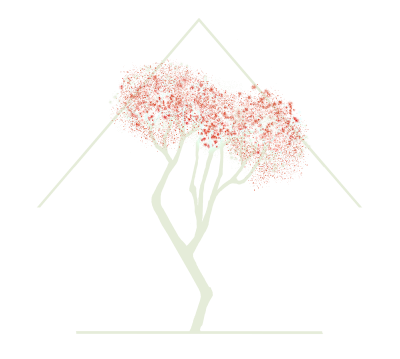
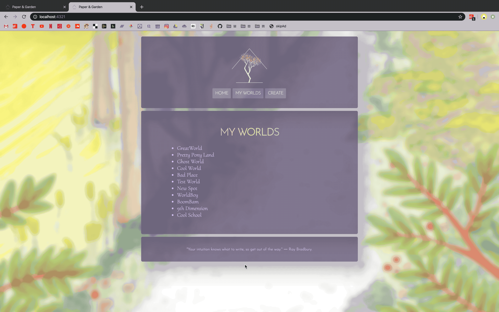

# Paper & Garden
## *A World Building Resource for Storytellers*

### Introduction
This ongoing personal project is an app for storytellers (novelists, screenwriters, etc.) to assist in world-building. I wanted to use this project as an opportunity to explore features new to me using raw React and CSS rather than utilizing libraries. Paper & Garden is a full-stack web application that takes in input about a fictional world and saves the information to a user's account.

### Live Demo
[http://papergarden.tay-made.com]

### What does the app do?
* Paper & Garden offers a user-friendly way to develop fictional worlds.
* It was built for creators to save and expand upon the worlds of their fiction.
* Users are able to fill out information based on the prompts and reference them during the writing process.

### Tech stack
* Language: JavaScript
* Client: React, CSS
* Server: Originally Express & Node.js, but have since moved into a serverless direction using Vercel deployment
* Database: mySQL

### Challenges
* I learned how to use React hooks and specifically how to create custom hooks to create a fully-functional form without utilizing a pre-made library.
* I designed a SQL database that would be scalable with my stretch goals.
* In December 2020 I had to reasses my database hosting. However, I fully designed a MySQL database to be able to accomodate future functionality.

### Minimum Viable Product:
* User can submit data and retrieve that data (null as of December 2020)
* Front end is accessible and responsive
* Back end is set up for future scalability

  
  
  

### How does the app work?
* When the user logs in, the information is validated via axios get request.
* When the user creates a new login, an axios post request sends the data through an Express/NodeJS server to a mySQL database, which only takes unique entries for usernames. If the username they desire already exists, it will send back an error to the client.
* When the user fills out a form, the information is saved in state via a custom React hook. 
* When the user submits a form, the information about the world they create is saved to a mySQL database.

### Required Research
* Though the original project was to accomplish the MVP of the concept, I will be using a Feature Branch Workflow as it evolves.
* I implement Agile Practices to organize and execute this project.

### Future Plans
* Full form functionality with increased usability (accordion drawer designs, etc)
* Unique user accounts
* Stress-Testing and prepping for increased traffic as features evolve
* Sharpening the usability of the interface
* Users are able to edit their worlds after submission
* Input pulls in information from a natural resources API and auto-fills flora, fauna, weather information, etc.
* Users are able to share their worlds, to editors, background artists, illustrators, DMs, etc.
* Sister apps for character development and plot development that integrate with the world storytellers have created
* And much more!
